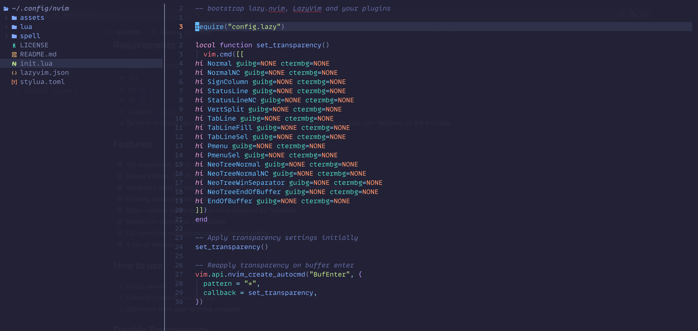

# 💤 Sammy's `nvim` config

_A tailored development environment based on @folke's [LazyVim](https://github.com/lazyvim/lazyvim)_
My setup depends on [Wezterm](https://wezterm.org/). You can clone mine from [my configs](https://github.com/sageil/wezterm)


## Requirements

- Neovim >= 0.11.4
- `git`
- `rg` [rg](https://github.com/BurntSushi/ripgrep)
- `fd` [fd](https://github.com/sharkdp/fd)
- `lazygit` [lazygit](https://github.com/jesseduffield/lazygit)
- Treesitter CLI [treesitter](https://github.com/tree-sitter/tree-sitter/blob/master/crates/cli/README.md)
- Terminal emulator like Ghostty, kitty, wezterm or alacritty. Screenshots are made on Mac with Wezterm as the emulator

## Features

- [x] IDE experience, out of the box
- [x] Debug Python, Go,Rust, and JavaScript out of the box.
- [x] Integrated tests for popular languages/frameworks (powered by Neotest)
- [x] Floating, persistent terminal
- [x] Editor context awareness and more powered by Treesitter.
- [x] Native vim spellcheck capabilities
- [x] LSP-sensitive completion context (import paths)
- [x] A ton of themes

## How to use

1. Install neovim
2. Clone this repo `git clone https://github.com/sageil/nvim ~/.config/nvim`
3. Start nvim from your terminal emulator

## Disable Transparency

1. Open `lua/plugins/colorscheme.lua`
2. Set the true transparency properties to false and remove the styles table:

```lua
return {
  {
    "folke/tokyonight.nvim",
    opts = {
      transparent = true,
      styles = {
        sidebars = "transparent",
        floats = "transparent",
      },
    },
  },
}

```
