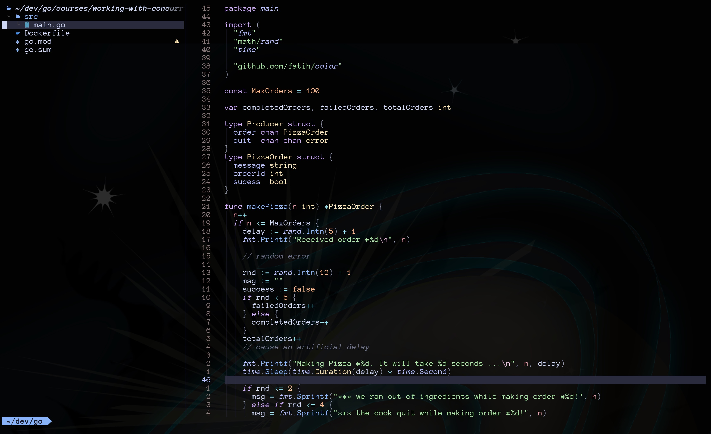
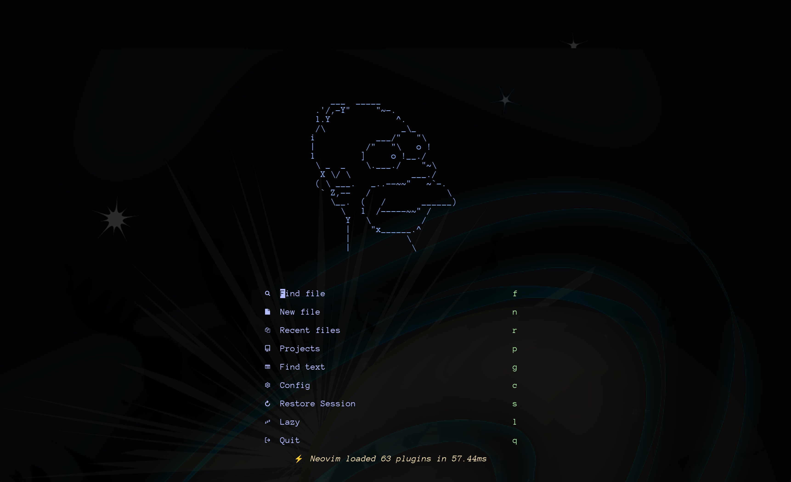
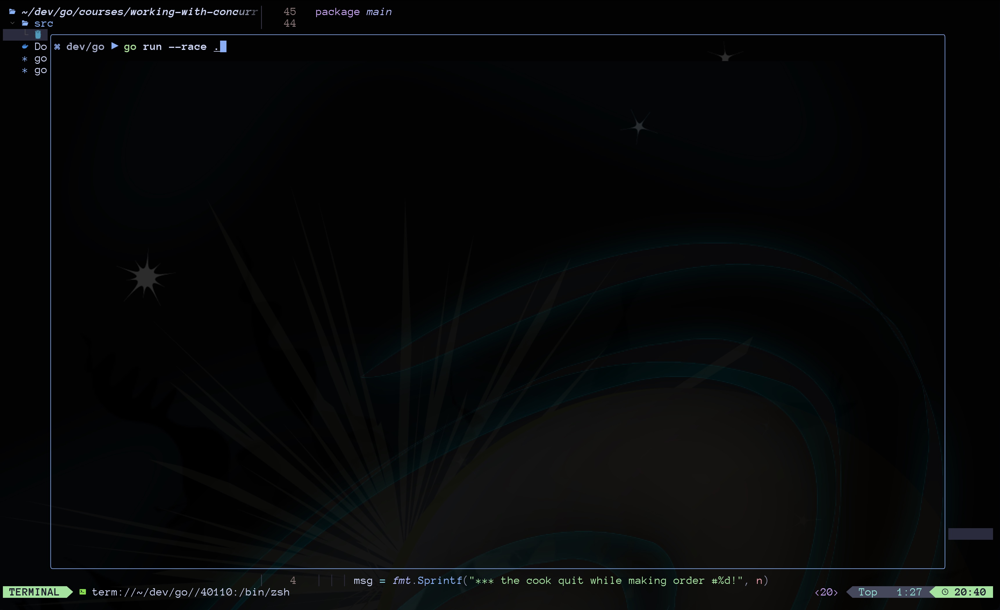
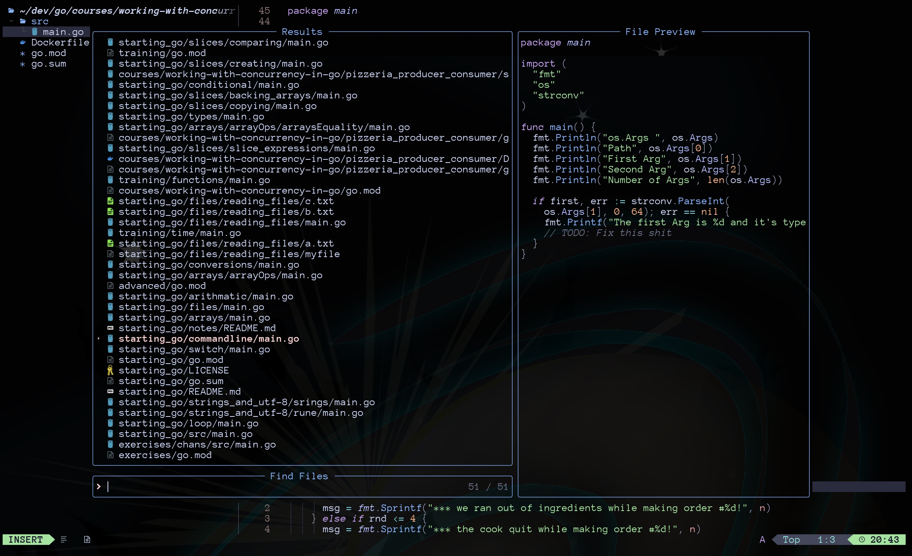
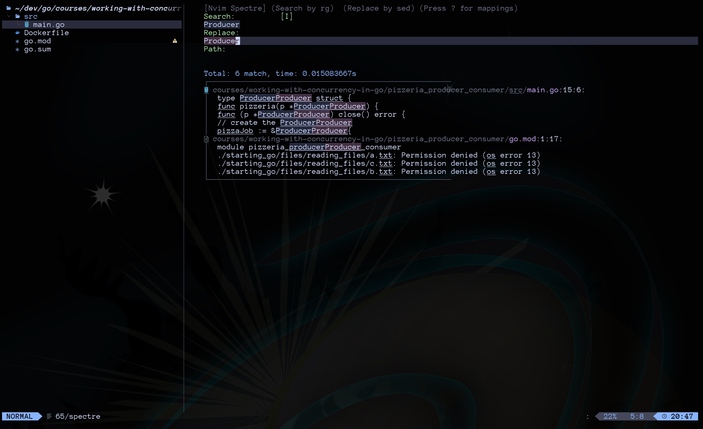
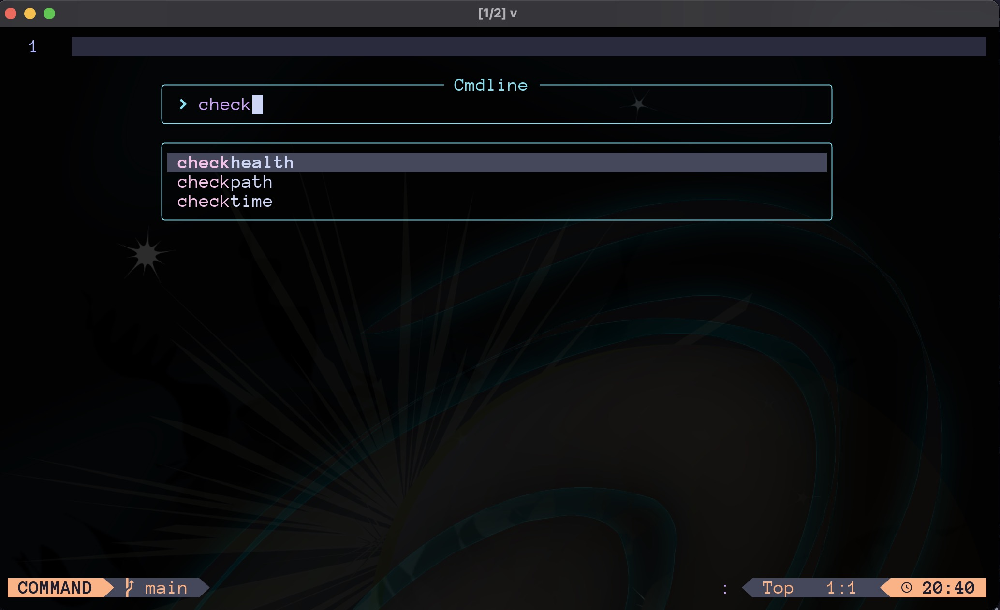

# 💤 Sammy's `nvim` config

_A tailored development environment based on @folke's [LazyVim](https://github.com/lazyvim/lazyvim)_

## Requirements

- Neovim >= 0.9.0
- `git`
- `rg` [rg](https://github.com/BurntSushi/ripgrep)
- `fd` [fd](https://github.com/sharkdp/fd)
- `lazygit` [lazygit](https://github.com/jesseduffield/lazygit)
- Terminal emulator like kitty, wezterm or alacritty. Screenshots are made on Mac M2 with Wezterm as the emulator

## Features

- [x] IDE experience, out of the box
- [x] Debug Python, Go, Rust, JS and others out of the box.
- [x] Integrated tests for popular languages/frameworks (powered by Neotest)
- [x] Floating, persistent terminal
- [x] Editor context awareness and more powered by Treesitter.
- [x] Native vim spellcheck capabilities
- [x] LSP-sensitive completion context (import paths)
- [x] A ton of themes

## Screenshots

## How to use

1. Install newvim
2. Clone this repo to `~/.config/`
3. Start nvim from your terminal emulator

## Note for none Mac M users

## Health Check

To validate the installation, run checkhealth in your installation

## Using F Keys to Debug

| Key |  Language  |              Function |
| --- | :--------: | --------------------: |
| F5  |    Rust    | Start RustDebuggables |
| F5  |     Go     |   Start Dap debugging |
| F5  |   Python   |   Start Dap debugging |
| F5  | Javascript |   Start Dap debugging |
| F10 | Step Over  |   Start Dap debugging |
| F11 | Step Into  |   Start Dap debugging |
| F12 |  Step Out  |   Start Dap debugging |

## Spellcheck tips

1. `[s` and `]s` to move to next and previous spelling errors
2. Use `zg` to add word to dictionary
3. Use `z=` to see suggestions
4. To see suggestions why in insert mode, use `<C-x>` followed by `s`
