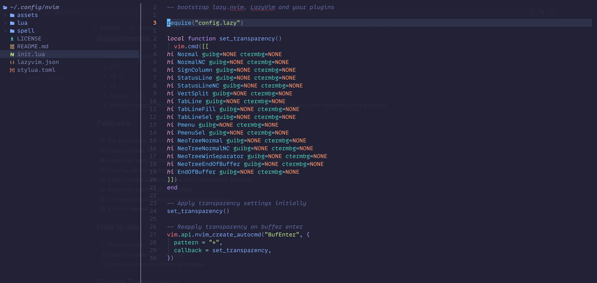

# 💤 Sammy's `nvim` config

_A tailored development environment based on @folke's [LazyVim](https://github.com/lazyvim/lazyvim)_


## Requirements

- Neovim >= 0.10.0
- `git`
- `rg` [rg](https://github.com/BurntSushi/ripgrep)
- `fd` [fd](https://github.com/sharkdp/fd)
- `lazygit` [lazygit](https://github.com/jesseduffield/lazygit)
- Terminal emulator like kitty, wezterm or alacritty. Screenshots are made on Mac with Wezterm as the emulator

## Features

- [x] IDE experience, out of the box
- [x] Debug Python, Go, JS and others out of the box.
- [x] Integrated tests for popular languages/frameworks (powered by Neotest)
- [x] Floating, persistent terminal
- [x] Editor context awareness and more powered by Treesitter.
- [x] Native vim spellcheck capabilities
- [x] LSP-sensitive completion context (import paths)
- [x] A ton of themes

## How to use

1. Install neovim
2. Clone this repo to `~/.config/`
3. Start nvim from your terminal emulator

## Disable Transparency

1. Open `init.lua`
2. Delete or comment all lines after `require("config.lazy")`

```lua
  vim.cmd([[
hi Normal guibg=NONE ctermbg=NONE
hi NormalNC guibg=NONE ctermbg=NONE
hi SignColumn guibg=NONE ctermbg=NONE
hi StatusLine guibg=NONE ctermbg=NONE
hi StatusLineNC guibg=NONE ctermbg=NONE
hi VertSplit guibg=NONE ctermbg=NONE
hi TabLine guibg=NONE ctermbg=NONE
hi TabLineFill guibg=NONE ctermbg=NONE
hi TabLineSel guibg=NONE ctermbg=NONE
hi Pmenu guibg=NONE ctermbg=NONE
hi PmenuSel guibg=NONE ctermbg=NONE
hi NeoTreeNormal guibg=NONE ctermbg=NONE
hi NeoTreeNormalNC guibg=NONE ctermbg=NONE
hi NeoTreeWinSeparator guibg=NONE ctermbg=NONE
hi NeoTreeEndOfBuffer guibg=NONE ctermbg=NONE
hi EndOfBuffer guibg=NONE ctermbg=NONE
]])
end

-- Apply transparency settings initially
set_transparency()

-- Reapply transparency on buffer enter
vim.api.nvim_create_autocmd("BufEnter", {
  pattern = "*",
  callback = set_transparency,
})

```
